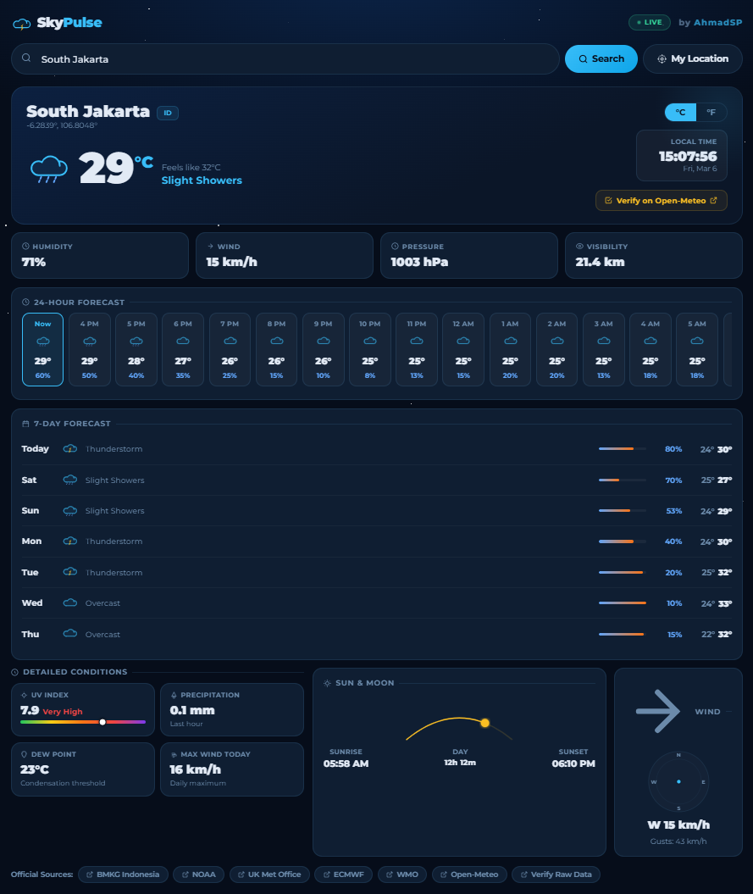

<div align="center">



# 🌤 SkyPulse — Real-Time Weather Intelligence

**A sleek, fully responsive weather web app powered by real open data sources.**  
Search any city on Earth, track live conditions, and verify accuracy through official meteorological agencies.

[](https://developer.mozilla.org/en-US/docs/Web/HTML)
[](https://developer.mozilla.org/en-US/docs/Web/CSS)
[](https://developer.mozilla.org/en-US/docs/Web/JavaScript)
[](https://open-meteo.com)
[](LICENSE)

<br/>


> _Replace the preview image above with an actual screenshot of your app._

</div>

---

## ✨ Features

| Feature                             | Description                                                              |
| ----------------------------------- | ------------------------------------------------------------------------ |
| 🔍 **Global Search + Autocomplete** | Search any city, region, or country worldwide with real-time suggestions |
| 📍 **GPS Location**                 | One-click detection of your current location via browser geolocation     |
| 🌡️ **°C / °F Toggle**               | Switch temperature units instantly across all values                     |
| ⏰ **Local City Clock**             | Live clock synced to the searched city's exact timezone                  |
| 📊 **24-Hour Forecast**             | Scrollable hourly breakdown with temperature & precipitation probability |
| 📅 **7-Day Forecast**               | Weekly overview with temperature range bars and weather icons            |
| 🌬️ **Wind Compass**                 | Animated compass showing real-time wind direction and gusts              |
| ☀️ **Sun Arc Visualizer**           | Live sun position arc with sunrise, sunset & day length                  |
| 🟡 **UV Index Meter**               | Color-coded UV scale from Low to Extreme                                 |
| 🚨 **Severe Weather Alerts**        | Auto-triggered banner for thunderstorms, heavy rain, and extreme events  |
| 🔗 **Official Source Verification** | Direct links to BMKG, NOAA, ECMWF, Met Office, WMO for cross-checking    |
| 📱 **Fully Responsive**             | Optimized for desktop, tablet, and mobile screens                        |
| 🔄 **Auto Refresh**                 | Weather data refreshes automatically every 10 minutes                    |

---

## 🛰️ Data Sources

SkyPulse fetches data exclusively from trusted, official meteorological sources:

| Source                        | Role                                               | Link                                                               |
| ----------------------------- | -------------------------------------------------- | ------------------------------------------------------------------ |
| **Open-Meteo**                | Primary weather API (ECMWF model)                  | [open-meteo.com](https://open-meteo.com)                           |
| **Nominatim / OpenStreetMap** | Geocoding & reverse geocoding                      | [nominatim.openstreetmap.org](https://nominatim.openstreetmap.org) |
| **TimeAPI.io**                | Timezone resolution per coordinate                 | [timeapi.io](https://timeapi.io)                                   |
| **BMKG**                      | Indonesian official meteorology agency             | [bmkg.go.id](https://www.bmkg.go.id)                               |
| **NOAA**                      | US National Oceanic & Atmospheric Administration   | [noaa.gov](https://www.noaa.gov)                                   |
| **UK Met Office**             | British national weather service                   | [metoffice.gov.uk](https://www.metoffice.gov.uk)                   |
| **ECMWF**                     | European Centre for Medium-Range Weather Forecasts | [ecmwf.int](https://www.ecmwf.int)                                 |
| **WMO**                       | World Meteorological Organization                  | [wmo.int](https://www.wmo.int)                                     |

> All data is fetched live with no caching layer — what you see is real-time.

---

## 🚀 Getting Started

No build tools, no dependencies, no installation required.

### Option 1 — Open directly in browser

```bash
git clone https://github.com/AhmadSP/skypulse.git
cd skypulse
# Open weather-app.html in your browser
open weather-app.html        # macOS
start weather-app.html       # Windows
xdg-open weather-app.html    # Linux
```

### Option 2 — Serve locally (recommended)

Using Python:

```bash
python3 -m http.server 8080
# Then open http://localhost:8080/weather-app.html
```

Using Node.js (`npx serve`):

```bash
npx serve .
```

### Option 3 — Deploy to GitHub Pages

1. Push this repo to GitHub
2. Go to **Settings → Pages**
3. Set source to `main` branch, root `/`
4. Your app will be live at `https://yourusername.github.io/skypulse/weather-app.html`

---

## 📁 Project Structure

```
skypulse/
│
├── weather-app.html     # Main app — single self-contained file
├── README.md            # You are here
└── LICENSE              # MIT License
```

> SkyPulse is intentionally built as a **single HTML file** — zero external dependencies, zero build steps, portable and lightweight.

---

## 📸 Screenshots

<details>
<summary>Click to expand</summary>

| Desktop View       | Mobile View        |
| ------------------ | ------------------ |
| _(Add screenshot)_ | _(Add screenshot)_ |

</details>

---

## 🌐 Live Demo

> 🔗 **[skypulse.vercel.app](https://skypulse.vercel.app)** _(update this with your actual deployment URL)_

---

## 🧰 Tech Stack

- **HTML5** — Semantic markup structure
- **CSS3** — Custom properties, CSS Grid, Flexbox, keyframe animations
- **Vanilla JavaScript** — Zero frameworks, zero dependencies
- **Google Fonts** — `Montserrat` + `Nunito` typography
- **SVG Icons** — All icons hand-crafted inline (no icon libraries)
- **Open-Meteo REST API** — Free, no API key required
- **Nominatim API** — Free geocoding via OpenStreetMap

---

## ⚙️ How It Works

```
User Input (city name / GPS)
        ↓
Nominatim Geocoding API
  → Resolves to lat/lon coordinates
        ↓
Open-Meteo Forecast API
  → Fetches current, hourly & daily weather
        ↓
TimeAPI.io
  → Resolves local timezone for the city
        ↓
SkyPulse renders:
  Current conditions · 24h forecast · 7-day forecast
  UV index · Wind compass · Sun arc · Alerts
        ↓
Official source links (BMKG, NOAA, ECMWF, etc.)
  → User can verify data independently
```

---

## 🔒 Privacy

- **No data is stored or sent to any server** controlled by this project
- All API calls go directly from your browser to the respective public APIs
- Location access is only used when you explicitly click **"My Location"** and is never stored

---

## 🤝 Contributing

Contributions, bug reports, and feature requests are welcome!

```bash
# Fork the repo, then:
git checkout -b feature/your-feature-name
git commit -m "feat: add your feature"
git push origin feature/your-feature-name
# Open a Pull Request
```

---

## 📄 License

This project is licensed under the **MIT License** — see the [LICENSE](LICENSE) file for details.

---

<div align="center">

Made with ☁️ by **[AhmadSP](https://github.com/AhmadSP)**

_If this project helped you, consider giving it a ⭐ on GitHub!_

</div>

